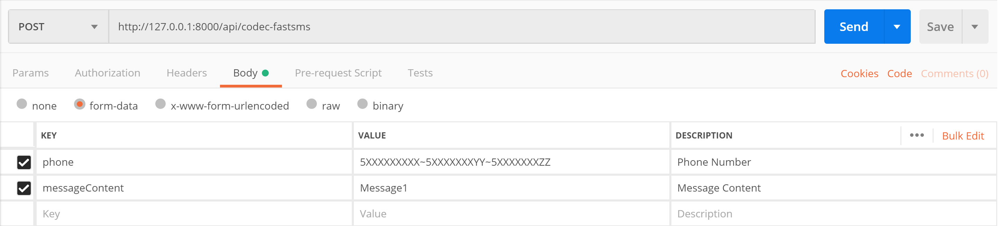

[Türkçe](doc#readme)
# Laravel CODEC FAST SMS

This package provides easy and painless integration of [Codec Messaging Platform API] into your
Laravel projects.

## Requirements
    Laravel >= 5.3
    PHP >= 5.6.4
        
## Installation
To get started, you should add the `hayrican/laravel-codec-fastsms` Composer dependency to your project:
```
composer require hayrican/laravel-codec-fastsms --dev
```

#### Service Provider (Laravel Older 5.5)

######If you are using later version of Laravel 5.5, you can skip this step.

Register provider on your `config/app.php` file.
```php
'providers' => [
    ...,
    HayriCan\CodecFastSms\CodecFastSmsServiceProvider::class,
]
```

## Configuration
You should publish vendor for configuration file which has API Credentials and other configs.
```bash
$ php artisan vendor:publish --provider="HayriCan\CodecFastSms\CodecFastSmsServiceProvider"
```

#### Codec Credentials
Navigate to `config/codecfastsms.php` and enter your Codec API credentials in this file.
```array
[
  'username'=> "CODEC_USERNAME",
  'password'=> "CODEC_PASSWORD",
  'sender'=> "CODEC_SENDER",
]
```

####  Route Configuration
Default router prefix is `api` and  middleware is `api`. In this section you can change prefix and middleware.
```array
[
  'route_prefix'=> 'api',

  'middleware'=> ['api'],
]
```
####  Save SMS Requests
Default value of record comes `false` and it means you sms requests are not going to save on database.
If you want to save you requests on database, you can make this field `true` as shown below
```array
[
  'record'=> true
]
```
After changed the record value to `true` on `config/codecfastsms.php` file, you should migrate the migration.
```bash
$ php artisan migrate
```
And `sms_records_table` will appear on your database.

## Usage
You can send sms via a `POST` request to `/codec-fastsms`
##### Eg.1. Send a message to a number

##### Eg.2. Send a message to multiple numbers

##### Eg.3. Send multiple messages to multiple numbers


### Post Required Parameters:

| Key                   | Value         | Description   |
| ---                   | ---           | ---           |
| `phone`               | 5XXXXXXXXX    |Phone number(s) to send multiple numbers you should put `~` between numbers. eg. `5XXXXXXXXX~5YYYYYYYYY`   |
| `messageContent`      | Message Text  |Message content(s) if you want to send different messages to different numbers you should put `~` between message contents. eg. `MessageContent1~MessageContent2`. NOTE: If you use this property, you should have equal number of phone and messageContent |


### Post Optional Parameters:

| Key                   | Value         | Description   |
| ---                   | ---           | ---           |
| `msgSpecialId `       | Message_Title |This field use for searching on the Codec system records |
| `headerCode `         | Header_Code   |You can use this field for tracking messages from Codec Customer Servis |
| `optionalParameters ` | OPTIONAL_PARAM|Optional parameters |

## Author

[Hayri Can BARÇIN]  
Email: [Contact Me]

## License

This project is licensed under the MIT License - see the [License File](LICENSE) for details


[//]: # (These are reference links used in the body of this note and get stripped out when the markdown processor does its job. There is no need to format nicely because it shouldn't be seen. Thanks SO - http://stackoverflow.com/questions/4823468/store-comments-in-markdown-syntax)
   [Codec Messaging Platform API]: <https://www.codec.com.tr/index-en.html#p1>
   [Hayri Can BARÇIN]: <https://www.linkedin.com/in/hayricanbarcin/>
   [Contact Me]: <mailto:hayricanbarcin@gmail.com>
