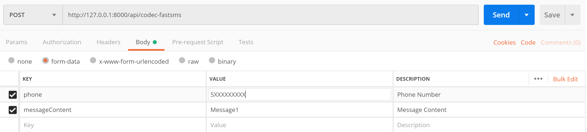
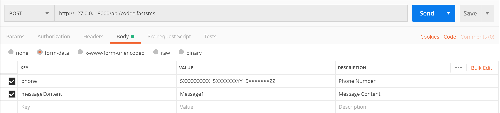
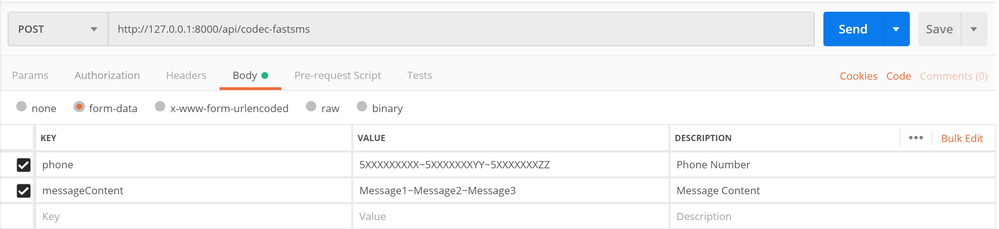

# Laravel CODEC FAST SMS
[](https://packagist.org/packages/hayrican/laravel-codec-fastsms)
[](https://packagist.org/packages/hayrican/laravel-codec-fastsms)
[](//packagist.org/packages/hayrican/laravel-codec-fastsms)
[](https://packagist.org/packages/hayrican/laravel-codec-fastsms)

Bu paket, Laravel projeleriniz üzerinde [Codec Mesajlaşma Platformu] 
entegresyonunu kolay ve sıkıntısız bir şekilde gerçekleştirmenize olanak sağlar.

## Gereksinimler
    Laravel >= 5.3
    PHP >= 5.6.4
        
## Kurulum
Öncelikle `hayrican/laravel-codec-fastsms` paketini projenizin Composer bağımlılıklarına eklemeniz gerekmektedir.
Bunun için aşağıdaki komutu projeniz içerisinde çalıştırın.
```
composer require hayrican/laravel-codec-fastsms
```

#### Service Provider (Laravel 5.5'ten Eski Versiyonlar)

##### Eğer Laravel 5.5 veya daha yeni bir versiyonunu kullanıyorsanız bu adımı atlayabilirsiniz.

Servis Provider kaydını `config/app.php` klasöründe yapınız.
```php
'providers' => [
    ...,
    HayriCan\CodecFastSms\CodecFastSmsServiceProvider::class,
]
```

## Konfigürasyon
Konfigürasyon dosyasını oluşturmak için vendor:publish komutunu çağırınız.
```bash
$ php artisan vendor:publish --provider="HayriCan\CodecFastSms\CodecFastSmsServiceProvider"
```

#### Codec API Erişim Bilgileri
Projenizde `config/codecfastsms.php` klasörünü görüntüleyip Codec API erişim bilgilerinizi buraya giriniz.
```array
[
  'username'=> "CODEC_USERNAME",
  'password'=> "CODEC_PASSWORD",
  'sender'=> "CODEC_SENDER",
]
```
####  Rota Yapılandırması
Varsayılan router prefix'i `api` ve middleware `api`. Bu bölümde prefix ve middleware bölümlerini düzenleyebilirsiniz.
```array
[
  'route_prefix'=> 'api',

  'middleware'=> ['api'],
]
```


####  SMS İsteğini Kaydet
Varsayılan record değeri `false` ve bunun anlamı sms istekleriniz veritabanına kaydedilmeyecek.
Eğer sms isteklerinizi veritabanına kaydetmek istiyorsanız bu alanı `true` yapınız.
```array
[
  'record'=> true
]
```
Değeri `true` olarak değiştirdikten sonra projeyi migrate etmeniz gerekiyor
```bash
$ php artisan migrate
```
Bu işlemden sonra `sms_records_table` tablosu veritabanınızda oluşturulacak.

# Paketin Kullanımı
## 1.HTTP Request
Artık `/codec-fastsms` rotasına `POST` isteği yaparak sms gönderebilirsiniz
##### Örn1. Bir numaraya mesaj gönderime

##### Örn2. Birden fazla numaraya aynı mesajı gönderme 

##### Örn3. Birden fazla numaraya farklı mesaj gönderme 



### Post Zorunlu Parametreler:

| Anahtar               | Değer         | Açıklama   |
| ---                   | ---           | ---           |
| `phone`               | 5XXXXXXXXX    |Gönderim yapmak istediğiniz telefon numarası veya birden fazla numaraya gönderim yapılacak ise ~ karakteri ile ayrılmış telefon numaraları. Örn. `5XXXXXXXXX~5YYYYYYYYY`|
| `messageContent`      | Mesaj İçeriği |Göndermek istediğiniz mesaj içeriği veya birden fazla numaraya gönderim yapılacak iste gönderilecek numara adedi kadar ~ karakteri ile ayrılmış mesaj içerikleri.Örn. `MessageContent1~MessageContent2`. NOT: Eğer bu özelliği kullanıyorsanız mesaj sayınız ile telefon numarası sayılarınızın aynı olmasına dikkat ediniz |


### Post İsteğe Bağlı Parametreler:

| Anahtar               | Değer         | Açıklama   |
| ---                   | ---           | ---           |
| `msgSpecialId `       | Message_Title |Gönderiminiz için belirlediğiniz konu başlığı. (Sistem kayıtlarında takibinin yapılabilmesi için kullanabilirsiniz) |
| `headerCode `         | Header_Code   |Servisin “GetSenderInfo” metodu ile veya müşteri hizmetlerinden temin edebileceğiniz numerik bir değerdir. Aynı alfanumeriği birden fazla sanal numara üzerinde veya operatörde kullanıyorsanız bu alfanumerikleri ayırt etmek için kullanılır. Bu parametre isteğe bağlıdır. Boş veya null bir değer girilebilir.   |
| `optionalParameters ` | OPTIONAL_PARAM|Boş veya null bir değer girilebilir. “İSTEĞE BAĞLI PARAMETRE KULLANIMI” bölümüne bakınız. |

## 2.Artisan Konsol
##### Örn1. Bir numaraya mesaj gönderime
```bash
$ php artisan fastsms:send --phone='5XXXXXXXXX' --messageContent='Message Text'
```
##### Örn2. Birden fazla numaraya aynı mesajı gönderme 
```bash
$ php artisan fastsms:send --phone='5XXXXXXXXX~5YYYYYYYYY~5ZZZZZZZZZ' --messageContent='Message Text'
```
##### Örn3. Birden fazla numaraya farklı mesaj gönderme 
```bash
$ php artisan fastsms:send --phone='5XXXXXXXXX~5YYYYYYYYY~5ZZZZZZZZZ' --messageContent='Message Text~Message Text2~Message Text3'
```
### Konsol Zorunlu Parametreler:

| Anahtar             | Değer         | Açıklama   |
| ---                 | ---           | ---           |
| `--phone`           | 5XXXXXXXXX    |Gönderim yapmak istediğiniz telefon numarası veya birden fazla numaraya gönderim yapılacak ise ~ karakteri ile ayrılmış telefon numaraları. Örn. `5XXXXXXXXX~5YYYYYYYYY`|
| `--messageContent`  | Mesaj İçeriği |Göndermek istediğiniz mesaj içeriği veya birden fazla numaraya gönderim yapılacak iste gönderilecek numara adedi kadar ~ karakteri ile ayrılmış mesaj içerikleri.Örn. `MessageContent1~MessageContent2`. NOT: Eğer bu özelliği kullanıyorsanız mesaj sayınız ile telefon numarası sayılarınızın aynı olmasına dikkat ediniz |


### Konsol İsteğe Bağlı Parametreler:

| Anahtar                   | Değer         | Açıklama   |
| ---                     | ---           | ---           |
| `--msgSpecialId `       | Mesaj Başlığı |Gönderiminiz için belirlediğiniz konu başlığı. (Sistem kayıtlarında takibinin yapılabilmesi için kullanabilirsiniz) |
| `--headerCode `         | Header_Code   |Servisin “GetSenderInfo” metodu ile veya müşteri hizmetlerinden temin edebileceğiniz numerik bir değerdir. Aynı alfanumeriği birden fazla sanal numara üzerinde veya operatörde kullanıyorsanız bu alfanumerikleri ayırt etmek için kullanılır. Bu parametre isteğe bağlıdır. Boş veya null bir değer girilebilir.   |
| `--optionalParameters`  | OPTIONAL_PARAM|Boş veya null bir değer girilebilir. “İSTEĞE BAĞLI PARAMETRE KULLANIMI” bölümüne bakınız. |


## Yazar

[Hayri Can BARÇIN]  
Email: [Contact Me]

## Lisans

This project is licensed under the MIT License - see the [License File](LICENSE) for details


[//]: # (These are reference links used in the body of this note and get stripped out when the markdown processor does its job. There is no need to format nicely because it shouldn't be seen. Thanks SO - http://stackoverflow.com/questions/4823468/store-comments-in-markdown-syntax)
   [Codec Mesajlaşma Platformu]: <https://www.codec.com.tr/#p1>
   [Hayri Can BARÇIN]: <https://www.linkedin.com/in/hayricanbarcin/>
   [Contact Me]: <mailto:hayricanbarcin@gmail.com>
